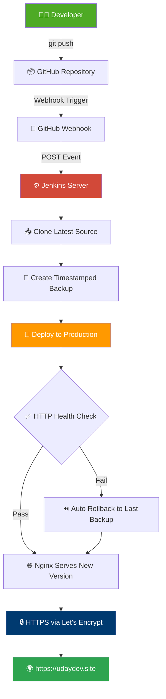
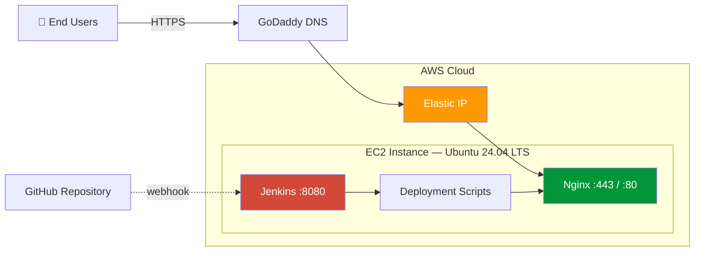
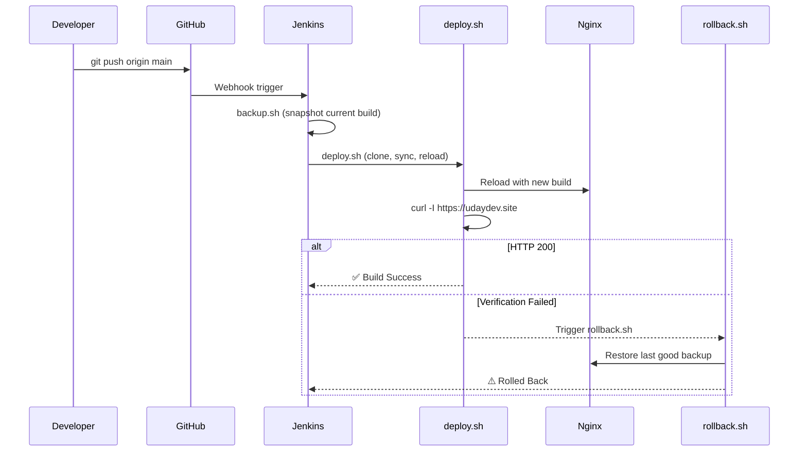
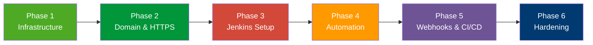

<div align="center">

# 🚀 DevOps Project 01 — Portfolio CI/CD Pipeline

### A Production-Style, Self-Healing Deployment Pipeline for a Personal Portfolio Website

**Every `git push` → Automatically Built, Backed Up, Deployed & Verified in Production**

[](https://udaydev.site)
[](#-cicd-pipeline)
[](#-tech-stack)
[](#-tech-stack)
[](#-security-best-practices)
[](LICENSE)

<br/>


<br/>

**[🌐 Live Demo](https://udaydev.site)** &nbsp;·&nbsp; **[📐 Architecture](#-architecture)** &nbsp;·&nbsp; **[⚙️ Pipeline](#-cicd-pipeline)** &nbsp;·&nbsp; **[📸 Screenshots](#-screenshots)** &nbsp;·&nbsp; **[📬 Contact](#-contact)**

</div>

---

## 📖 Table of Contents

<details>
<summary>Click to expand</summary>

- [Overview](#-overview)
- [Architecture](#-architecture)
- [Tech Stack](#-tech-stack)
- [Folder Structure](#-folder-structure)
- [Features](#-features)
- [Project Phases](#-project-phases)
- [CI/CD Pipeline](#-cicd-pipeline)
- [Deployment Scripts](#-deployment-scripts)
- [Security Best Practices](#-security-best-practices)
- [Jenkins Configuration](#-jenkins-configuration)
- [GitHub Webhooks](#-github-webhooks)
- [Troubleshooting](#-troubleshooting)
- [Skills Demonstrated](#-skills-demonstrated)
- [Future Improvements](#-future-improvements)
- [Screenshots](#-screenshots)
- [Live Pipeline Evidence](#-live-pipeline-evidence)
- [About the Author](#-about-the-author)
- [Contact](#-contact)
- [License](#-license)

</details>

---

## 🧭 Overview

**DevOps Project 01** is a production-style CI/CD pipeline that automates the full deployment lifecycle of my personal portfolio — [**udaydev.site**](https://udaydev.site) — from `git push` to a verified, live update, with no manual server access required.

Manual deployment is slow and risky: no repeatable process, no backup strategy, no way back if something breaks. This project replaces that with an event-driven pipeline that watches the repository, deploys automatically, verifies itself with a live HTTP check, and rolls back on failure.

> 💡 **Flow:** push code → GitHub notifies Jenkins → Jenkins backs up, deploys, and verifies → site updates in seconds, with automatic rollback if verification fails.

---

## 🏗 Architecture

<div align="center">



</div>

### Infrastructure Diagram



### Deployment Sequence



---

## 🧰 Tech Stack

<div align="center">

| Category | Technology |
|---|---|
| **Frontend** | HTML5, CSS3, JavaScript |
| **OS** | Ubuntu 24.04 LTS |
| **Cloud** | AWS EC2 |
| **Web Server** | Nginx |
| **CI/CD** | Jenkins (Freestyle Job) |
| **Version Control** | Git & GitHub |
| **Automation Trigger** | GitHub Webhooks |
| **Security** | Let's Encrypt (Certbot) |
| **DNS** | GoDaddy |
| **Scripting** | Bash |

</div>

---

## 📁 Folder Structure

Actual structure as cloned into the Jenkins workspace:

```
devops-project-01-portfolio-cicd-pipeline/
├── assets/                # Images, icons, fonts
├── deployment/             # backup.sh, deploy.sh, rollback.sh
├── docs/screenshots/       # README screenshots
├── index.html
├── style.css
├── script.js
├── .gitignore
├── README.md
└── LICENSE
```

> On the server, this repo is cloned by `deploy.sh` and synced into the Nginx web root (`/var/www/udaydev.site`). Logs and backups live separately under `/opt/deployment/` and aren't version-controlled.

---

## ✨ Features

<table>
<tr>
<td width="50%" valign="top">

**Deployment**
- Automated push-to-deploy pipeline
- Zero manual server access
- HTTP-based verification gate
- Sub-minute deploy times

</td>
<td width="50%" valign="top">

**Reliability & Security**
- Timestamped backups + rotation
- One-command rollback
- HTTPS enforced, auto-renewing SSL
- Scoped `sudo` for Jenkins (least privilege)

</td>
</tr>
</table>

---

## 🗺 Project Phases

<div align="center">



</div>

| Phase | What Was Done |
|---|---|
| **1 — Infrastructure** | Launched AWS EC2 (Ubuntu 24.04), configured SSH key auth, Security Groups (ports 22/80/443 only), attached an Elastic IP for a static public address |
| **2 — Domain & HTTPS** | Installed Nginx, pointed `udaydev.site` via GoDaddy DNS, configured HTTP → HTTPS redirect, installed Let's Encrypt SSL with automatic renewal |
| **3 — Jenkins Setup** | Installed Java, Git, and Jenkins; configured GitHub PAT, connected the repo, created the Freestyle job; resized the EBS volume and added swap to handle build load |
| **4 — Automation** | Wrote `backup.sh` and `deploy.sh`, added structured logging and error handling, scoped `sudo` for Jenkins, wired an HTTP verification gate |
| **5 — Webhooks & CI/CD** | Configured the GitHub webhook, enabled the Jenkins hook trigger, debugged delivery failures, validated full end-to-end automation |
| **6 — Hardening** | Added `rollback.sh`, backup rotation, workspace/build-history cleanup, stricter verification, and Jenkins security hardening (CSRF protection, scoped credentials) |

**Live EC2 instance:** `i-01b87c6e6991e0a1a` · `t3.micro` · us-east-1 · 🟢 Running · `18.234.42.213`

<details>
<summary><b>Real issue hit: disk space</b></summary>

<br/>

Jenkins' workspace and plugin cache outgrew the default 8GB EBS volume during Phase 3. Fixed by resizing the volume, extending the filesystem with `resize2fs`, and adding swap — a constraint tutorials rarely cover.

</details>

---

## ⚙️ CI/CD Pipeline

<div align="center">

| Stage | Trigger | Action | On Failure |
|---|---|---|---|
| 1️⃣ Trigger | `git push` to `main` | GitHub webhook notifies Jenkins | — |
| 2️⃣ Checkout | Webhook received | Jenkins clones latest commit | Build marked failed |
| 3️⃣ Backup | Pre-deploy | `backup.sh` snapshots current build | Deployment aborted |
| 4️⃣ Deploy | Post-backup | `deploy.sh` syncs new build to web root | Triggers rollback |
| 5️⃣ Verify | Post-deploy | `curl -I` checks live domain for HTTP 200 | Triggers rollback |
| 6️⃣ Rollback | Verification failure | `rollback.sh` restores last good backup | Logged |

</div>

---

## 📜 Deployment Scripts

<details>
<summary><b><code>backup.sh</code></b> — timestamped snapshot before every deploy</summary>

```bash
#!/bin/bash
set -euo pipefail

SOURCE_DIR="/var/www/udaydev.site"
BACKUP_ROOT="/opt/deployment/backups"
TIMESTAMP=$(date +"%Y%m%d_%H%M%S")
BACKUP_DIR="${BACKUP_ROOT}/${TIMESTAMP}"
LOG_FILE="/opt/deployment/logs/deploy.log"

echo "[$(date)] Starting backup..." | tee -a "$LOG_FILE"
mkdir -p "$BACKUP_DIR"
cp -r "$SOURCE_DIR"/* "$BACKUP_DIR"/
echo "[$(date)] Backup completed: $BACKUP_DIR" | tee -a "$LOG_FILE"

# Retention: keep only the last 5 backups
cd "$BACKUP_ROOT"
ls -1t | tail -n +6 | xargs -r rm -rf
```

</details>

<details>
<summary><b><code>deploy.sh</code></b> — clone, sync, reload, verify</summary>

```bash
#!/bin/bash
set -euo pipefail

REPO_URL="https://github.com/Gella-Uday-kumar/devops-project-01-portfolio-cicd-pipeline.git"
CLONE_DIR="/opt/deployment/tmp_clone"
TARGET_DIR="/var/www/udaydev.site"
SITE_URL="https://udaydev.site"
LOG_FILE="/opt/deployment/logs/deploy.log"

rm -rf "$CLONE_DIR"
git clone --depth 1 "$REPO_URL" "$CLONE_DIR"
rsync -a --delete "$CLONE_DIR"/website/ "$TARGET_DIR"/
sudo systemctl reload nginx

HTTP_STATUS=$(curl -o /dev/null -s -w "%{http_code}" "$SITE_URL")
if [ "$HTTP_STATUS" -eq 200 ]; then
    echo "[$(date)] ✅ Deployment verified. HTTP $HTTP_STATUS" | tee -a "$LOG_FILE"
    exit 0
else
    echo "[$(date)] ❌ Verification failed — rolling back" | tee -a "$LOG_FILE"
    bash /opt/deployment/scripts/rollback.sh
    exit 1
fi
```

</details>

<details>
<summary><b><code>rollback.sh</code></b> — restore last known-good backup</summary>

```bash
#!/bin/bash
set -euo pipefail

BACKUP_ROOT="/opt/deployment/backups"
TARGET_DIR="/var/www/udaydev.site"
LOG_FILE="/opt/deployment/logs/rollback.log"

LATEST_BACKUP=$(ls -1t "$BACKUP_ROOT" | head -n 1)
[ -z "$LATEST_BACKUP" ] && { echo "No backups available!" | tee -a "$LOG_FILE"; exit 1; }

rsync -a --delete "$BACKUP_ROOT/$LATEST_BACKUP"/ "$TARGET_DIR"/
sudo systemctl reload nginx
echo "[$(date)] ✅ Rolled back to $LATEST_BACKUP" | tee -a "$LOG_FILE"
```

</details>

---

## 🔐 Security Best Practices

- SSH key-based authentication only — password login disabled
- Security Groups restrict inbound traffic to ports `22`, `80`, `443`
- HTTPS enforced everywhere; HTTP redirects to HTTPS
- Automatic SSL renewal via Certbot
- Jenkins runs with **scoped `sudo`** — only the exact commands it needs, not root access
- GitHub PAT stored as a Jenkins credential, never hardcoded or committed
- CSRF protection and restricted script approval enabled in Jenkins

<details>
<summary>Example: scoped sudoers entry for Jenkins</summary>

```
# /etc/sudoers.d/jenkins
jenkins ALL=(ALL) NOPASSWD: /bin/systemctl reload nginx
jenkins ALL=(ALL) NOPASSWD: /usr/bin/rsync
```

</details>

---

## 🔧 Jenkins Configuration

| Setting | Value |
|---|---|
| Job Type | Freestyle Project |
| SCM | Git → `*/main` |
| Build Trigger | GitHub hook trigger for GITScm polling |
| Build Steps | `backup.sh` → `deploy.sh` |
| Post-build | Workspace cleanup, build log archiving |
| Build Retention | Last 10 builds |

---

## 🔗 GitHub Webhooks

| Field | Value |
|---|---|
| Payload URL | `http://<jenkins-server>:8080/github-webhook/` |
| Content type | `application/json` |
| Events | Just the push event |

On push, GitHub `POST`s the event to Jenkins, which triggers the job instantly — no polling delay.

---

## 🛠 Troubleshooting

<details>
<summary>Webhook shows "Failed to connect" in GitHub delivery logs</summary>
<br/>
Jenkins port not open in the EC2 Security Group. Confirm inbound access on the Jenkins port, or proxy it through Nginx on 443.
</details>

<details>
<summary>Jenkins job doesn't trigger on push</summary>
<br/>
"GitHub hook trigger for GITScm polling" not enabled, or the payload URL is missing its trailing slash.
</details>

<details>
<summary>"Permission denied" when Jenkins runs deploy.sh</summary>
<br/>
The <code>jenkins</code> user lacks a scoped sudoers entry for the commands the script needs — add one instead of granting broad access.
</details>

<details>
<summary>Disk fills up over time</summary>
<br/>
Unbounded backups and Jenkins build history. Solved with backup rotation and "Discard old builds."
</details>

---

## 🎯 Skills Demonstrated

<div align="center">

| Domain | Skills |
|---|---|
| **Cloud** | AWS EC2, Security Groups, Elastic IP, EBS/filesystem management |
| **CI/CD** | Jenkins job design, build triggers, pipeline verification |
| **Linux** | Ubuntu administration, systemd, swap configuration |
| **Web Servers** | Nginx config, reverse proxy, SSL termination |
| **Security** | SSH hardening, HTTPS, least-privilege `sudo` scoping |
| **Scripting** | Bash automation, error handling, structured logging |
| **Reliability** | Backup strategy, rollback strategy, deployment verification |

</div>

---

## 🔮 Future Improvements

- [ ] Migrate to a Jenkins Declarative Pipeline (`Jenkinsfile`)
- [ ] Containerize with Docker
- [ ] Provision infrastructure with Terraform
- [ ] Add Prometheus + Grafana monitoring
- [ ] Blue-green deployment for zero-downtime releases

---

## 📸 Screenshots

<div align="center">

**Live Portfolio — [udaydev.site](https://udaydev.site)**


<details>
<summary>Full page preview</summary>


</details>

</div>

---

## 🔴 Live Pipeline Evidence

<div align="center">

| Jenkins Build History | Jenkins Workspace |
|---|---|
|  |  |

| GitHub Webhook Deliveries | AWS EC2 Instance |
|---|---|
|  |  |

**Last Success:** Build #7 · **Last Failure:** N/A · **Jenkins:** 2.555.3 · All recent webhook deliveries ✅ delivered

</div>

---

## 👨‍💻 About the Author

<div align="center">

### Gella Uday Kumar
**DevOps Engineer | Cloud Enthusiast | Automation Learner**

I'm building hands-on DevOps experience by operating real infrastructure end-to-end — not just describing it. This pipeline runs in production, right now.

</div>

---

## 📬 Contact

<div align="center">

[](mailto:gellaudaykumar2329@gmail.com)
[](https://github.com/Gella-Uday-kumar)
[](https://www.linkedin.com/in/gella-uday-kumar/)
[](https://udaydev.site)

</div>

---

## 📄 License

Licensed under the [MIT License](LICENSE).

---

<div align="center">

### 🚀 Built with Jenkins, Nginx, AWS — and a refusal to deploy manually ever again.

**[⬆ Back to Top](#-devops-project-01--portfolio-cicd-pipeline)**

</div>
